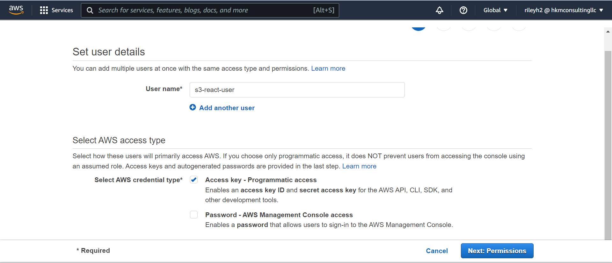

# AWS Training Labs - Hosting a Static React Application Through S3

This lab should describe the process of going through the setup and deployment of 
a single-page React application using AWS S3 bucket's static hosting features.

## Setup Before Starting

The main requirement for setup is that whomever goes through this lab has a 
React project which they can use for deployment. It mainly for educational purposes
personally, but feel free to use it as you see fit.

A simple React project should be provided in the repository in this lab, but you can choose
to use any project which they have on hand. Make sure to go through the appropriate steps for setup of
the React project.

In addition, there might be requirements to setup the AWS CLI depending on what steps you
would like to take for deploying your application to S3.

Lastly, you are going to need a form of AWS account from which you can work off of. This resource
from the documentation for AWS might be able to help in creating an account. Note that there are charges
that can be placed on utilizing AWS resources so be careful in what you use, but for this project
the charges should be non-existent if you are using it in a short-term project.

## Work in the AWS Console

This project will start with configuring the resources in AWS that will be required for other
aspects of the project.

Start by going into the AWS console after signing into your account and in the search bar enter "s3".
Clicking on S3 should bring you to a page displaying all of the buckets associated with the account
organization/group. 


From here, there should be an option to create a bucket which you can then click. If that doesn't work, there
is a "buckets" option on the left sidebar that should bring you to the appropriate page.

In creating the bucket, you will have to provide a bucket name. Make sure that it is unique, as all buckets
in S3 share a global namespace meaning you cannot have a bucket name that someone else has already claimed.

Once you provide a name, continue to scroll down until you reach the options for public access. Uncheck the 
option of denying public access, since unchecking this allows you to view the bucket/application contents.


Once that is done, you will be brought back to the buckets page. Select the bucket which you have just
created. This will bring you to the bucket contents. Click on the tab for "properties".

In the properties tab, scroll down until you reach the section on "static web hosting". Click on the edit
option and then the option to enable static web hosting. 


Once you do that you will have to provide the filename for the index html page of the react project. Put the name of that file and 
then continue to scroll down until you see the save changes button, at which point you can click it to 
exit.

## Creating a bucket policy

While we have enabled public access to the bucket on creation, we must also modify the 
bucket policy with permissions for people to allow access to the bucket for reading. 
Click on the permissions tab of the bucket and where it says "bucket policy", click edit.

From this point you will be shown a bucket policy written in JSON. You can type this in on
your own, but the required bucket policy is provided below, execpt for the resource which will
have to be changed to your buckets unique ARN, which is provided above the bucket policy edit section:

```
{
	"Version": "2012-10-17",
	"Statement": [
		{
			"Sid": "AllowReadAccess",
			"Principal": "*",
			"Effect": "Allow",
			"Action": ["s3:GetObject"],
			"Resource": ["arn:aws:s3:::hjriley-react-sample-project/*"]
		}
	]
}
```

Make sure that you are keeping the `/*` at the end of the resource to allow
all parts of the bucket to be accessed.

## Reccommended - Creating an IAM user that can be used with the AWS CLI

In order to get into the best habits of creating roles that only have the access they need, 
it is a good idea to create an IAM role that can be used for
reading/writing to the S3 bucket.

Start by searching for IAM in the console, and then after clicking on IAM, click on
the button for users in the left sidebar. Click on the button to create a new user after
you are brought to the user page.

From this point, you will go through the process of creating a user. Give the user a name,
and give it programatic access so that we can then use it later on with the CLI/SDK.



From this point you then will be prompted to attach policies to the user. In order for it to 
have access, put in the AmazonS3FullAccess policy which you can find through searching in the 
search bar. Check the policy.


At this point continue on until you reach the end and are provided with an access ID and secret
key. These are going to be crucial in configuring on the CLI, so make sure to save them somewhere. If
you do not you will have to generate new access keys.

## Uploading the React project to S3

Based on the options of what has been done so far, there are several different options
that can be taken when uploading the React project to S3: either we can perform a direct
upload or we can build in commands to the project that allow project builds to be synced 
to the S3 bucket, being "deployed" in a sense.

### Directly Uploading Files

Directly Uploading files could be simpler in the short-term but I do not reccommend it,
due to being a hassle to constantly remember to upload files for a React project. Uploading directly
is as simple as building your project locally using either NPM or yarn, taking
the build files, clicking on the "upload" button for the bucket in AWS, and uploading the files/folders. Once that is done, and
barring that the previous steps were correct, you should see the uploaded React project through
visiting the static web hosting URL provided in the static web hosting section of permissions.

Note: If you are building the project locally, you might get some warnings due to linting for
the hrefs using a blank value. It is fine to ignore these errors. In addition there can be possible
discrepancies between the stylings of the build and what was uploaded, but there should not be
many major discrepancies.

### Building a Command to deploy your React project to S3

This method is the more complex but easier in the long-run way to have your build command synced to
your S3 bucket. Start this process through going into a command terminal and running the command `aws configure`.

This command will prompt you for an access ID and secret key, which you should have gotten from the previous step
in configuring an IAM user. Put those in, and then you can leave the other two values blank afterwards.

Once both of those values are put in, you can test the configuration through running `aws s3 ls`. This will list
out all of the buckets which you have in your console.

If this is setup, you can then go through in adding the appropriate commands. In the package.json file, put in a new
command under `"Scripts"` that goes as follows: 

```
"deploy": aws s3 sync build/ s3://<YOUR-BUCKET-NAME-HERE>
```

Making sure to replace the bucket name with your own. Once that is done, you should be able to run `npm run build` followed
by `npm run deploy`, and you now have a workflow for building and deploying changes to your static website within the S3 bucket.

## Cleanup of project

Make sure that whatever you have worked with in relation to AWS is removed accordingly 
in order to avoid further charges to your account if you are not planning on keeping the project up. 
This mainly will be remembering to delete
the S3 bucket which you created for the project if you don't intend on keeping it up, and 
possibly as well deleting the IAM role if you aren't going to use it for future projects.

## Conclusions

Hopefully if you are using this for the purpose of learning how to setup a static website in
an S3 bucket I hope that it helps you. Of course though, this isn't the only place to learn how
to do this, and if it isn't helping you I encourage you to look at other resources. On a final note,
note that this is for static applications, meaning that once you get to working with other
applications that involve more than a static page it is for the best to use other practices
and ways of deployment for an application. Despite this, I hope this has helped in some form.
Happy Coding!

